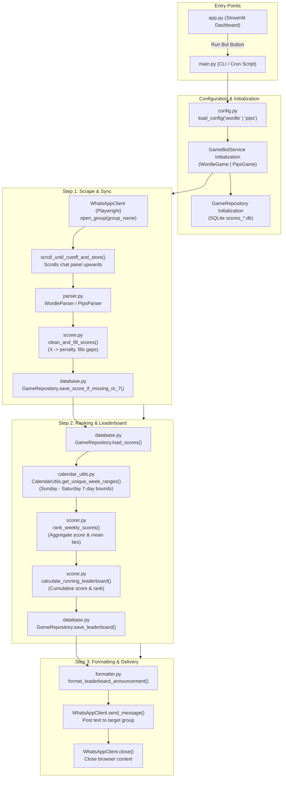
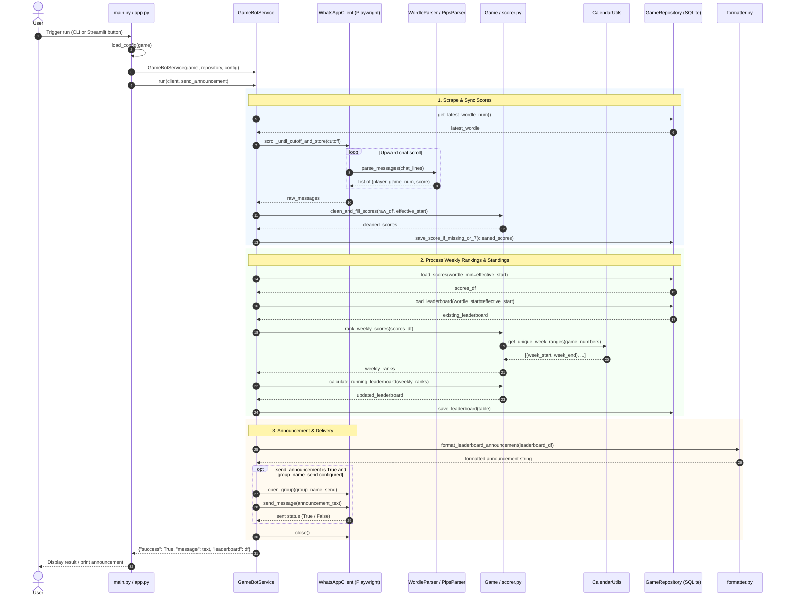

# GameBot End-to-End Execution Flow

This document details the end-to-end architecture and code execution workflow of the GameBot application (supporting both Wordle and Pips).

---

## 1. Execution Architecture Diagram

---

## 2. End-to-End Sequence Diagram

---

## 3. Step-by-Step Execution Breakdown

### Phase 1: Initialization & Configuration
- **Entry Points**:
  - `src/app.py`: Interactive Streamlit dashboard allowing users to customize settings, trigger bot runs, and visualize leaderboard trends.
  - `src/main.py`: Headless command-line entrypoint.
- **Config Management** (`src/game_bot/config.py`):
  - `load_config(game)` reads `config_wordle.json` or `config_pips.json` with domain fallback defaults.
  - Dataclasses `WordleConfig` and `PipsConfig` store target chat names and start number limits.
- **Service & Repository Setup**:
  - `GameBotService` is instantiated with the corresponding `Game` strategy (`WordleGame` or `PipsGame`) and `GameRepository` (pointing to `scores_wordle.db` or `scores_pips.db`).

### Phase 2: Scraping & Syncing Scores (`scrape_and_sync_scores`)
- **Browser Automation** (`src/game_bot/whatsapp.py`):
  - Uses Playwright to launch a persistent Chromium context at `https://web.whatsapp.com`.
  - Searches and opens the WhatsApp reading group via `open_group()`.
- **Chat Scrolling & Cutoff Check**:
  - Queries `GameRepository.get_latest_wordle_num()` to find the most recent puzzle number in the database.
  - Repeatedly scrolls upward until messages preceding the cutoff puzzle number are loaded.
- **Message Parsing** (`src/game_bot/parser.py`):
  - Uses regex patterns to identify game headers (`Wordle <num> <score>/6` or `Pips #<num> <difficulty> <emoji> <time>`) and walks backward to locate the sender from WhatsApp timestamps.
- **Cleaning & Penalty Filling** (`src/game_bot/scorer.py`):
  - `clean_and_fill_scores()` converts failure `"X"` entries to penalty values (`7` for Wordle, `5` for Pips).
  - Cross-joins active players with the sequence of game numbers to fill unplayed intermediate days with penalties, while leaving the latest in-progress day as `None`.
- **Database Persistence** (`src/game_bot/database.py`):
  - `GameRepository.save_score_if_missing_or_7()` inserts newly discovered scores and overwrites penalty placeholders without clobbering valid historical entries.

### Phase 3: Weekly Rankings & Cumulative Standings (`process_and_update_leaderboards`)
- **Score Loading**:
  - Pulls historical score records from SQLite starting at `effective_start`.
- **Calendar Boundaries** (`src/game_bot/calendar_utils.py`):
  - Computes 7-day Sunday-to-Saturday competition weeks based on the game's anchor number and anchor weekday.
- **Weekly Score Aggregation & Ranking** (`src/game_bot/scorer.py`):
  - `compute_weekly_scores()` aggregates total scores per player, omitting incomplete trailing weeks.
  - `rank_weekly_scores()` assigns sequential ranks and handles score ties using mean ranking.
- **Running Leaderboard Accumulation**:
  - `calculate_running_leaderboard()` computes cumulative overall scores and overall ranks across consecutive weeks.
  - `GameRepository.save_leaderboard()` persists weekly leaderboard snapshots.

### Phase 4: Announcement Formatting & WhatsApp Dispatch
- **Message Formatting** (`src/game_bot/formatter.py`):
  - `format_leaderboard_announcement()` formats the latest week's results and overall standings into WhatsApp monospace text tables with trophies and headers.
- **WhatsApp Message Sending**:
  - If `send_announcement` is enabled, navigates to the announcement recipient group (`group_name_send`).
  - Dispatches the announcement text and verifies delivery via `send_message()`.
- **Teardown**:
  - Closes the Playwright browser session and SQLite database connection safely.
